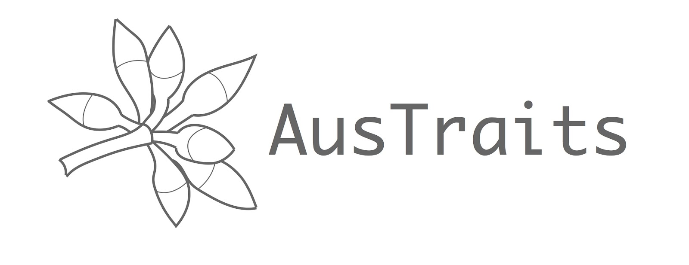

AusTraits is an open-source, harmonized database of Australian plant trait data. It synthesises data on 448 traits across 28640 taxa from field campaigns, published literature, taxonomic monographs, and individual taxon descriptions. Begun in 2016 as an initiative between three lab groups, it has grown to be the largest collation of plant trait data for Australian plants.

AusTraits integrates plant trait data collected by researchers from diverse disciplines, including functional plant biology, plant physiology, plant taxonomy, and conservation biology. By harmonizing and error checking values, linking all AusTraits data entries to detailed metadata, and documenting trait and trait values definitions, AusTraits is a resource researchers can trust and use for their research agendas with minimal additional filtering or manipulations.  

An AusTraits data paper was recently published in *Scientific Data* and is available at: [10.1038/s41597-021-01006-6](http://doi.org/10.1038/s41597-021-01006-6). 

Dataset on Zenodo: 

Almetric score:
Almetrics:

[](contributors/)
