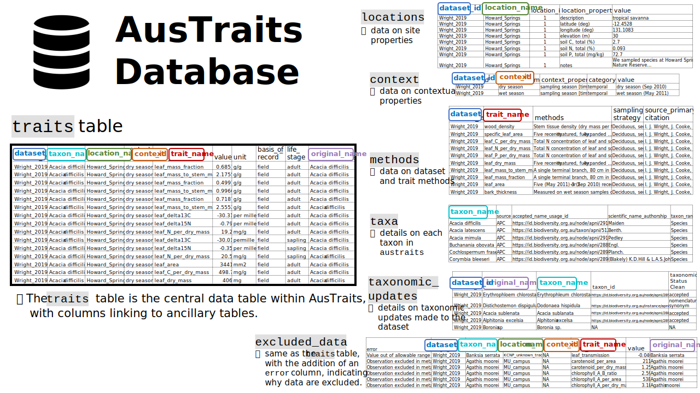
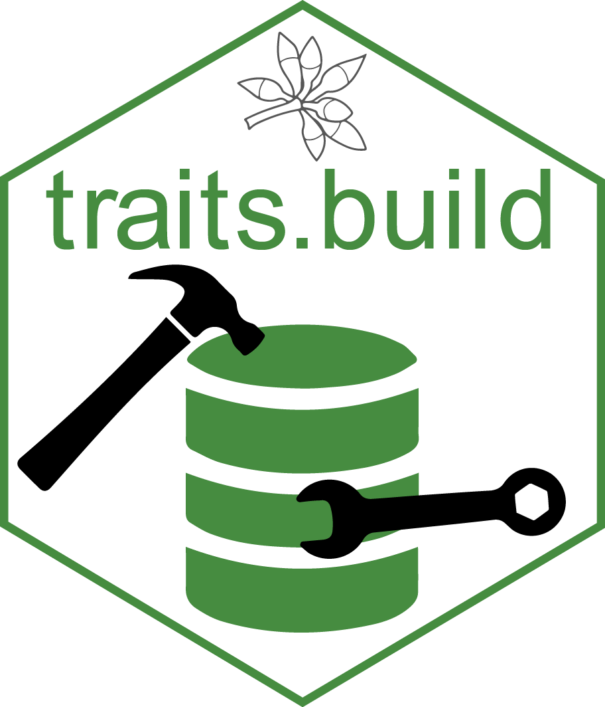
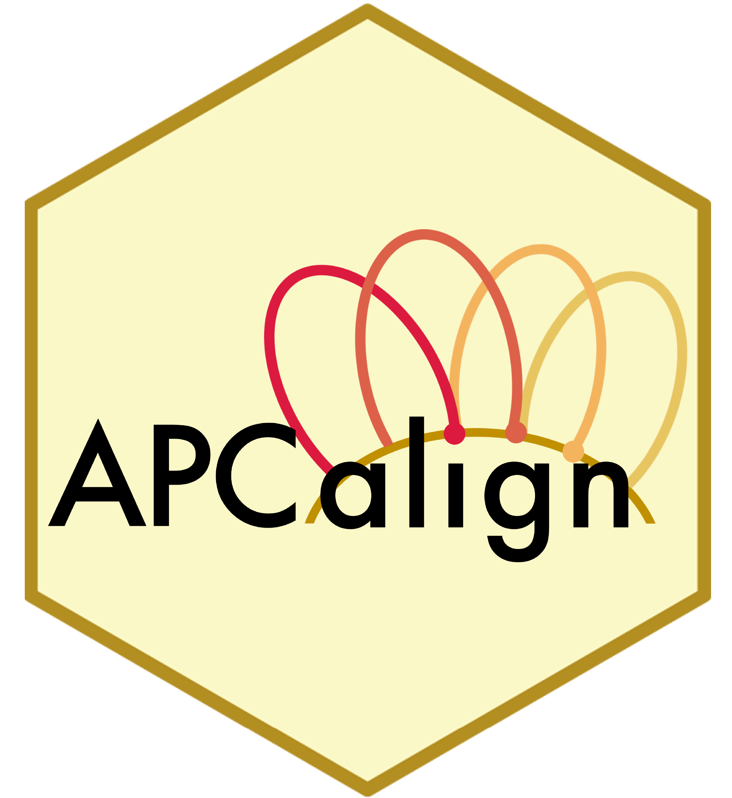
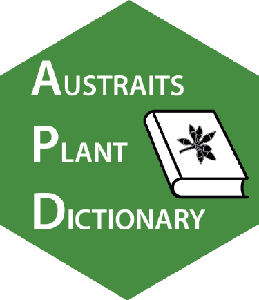

```{=html}
<section class="platform-hero" aria-labelledby="hero-title">
  <div class="platform-shell hero-grid">
    <div class="hero-copy">
      <p class="eyebrow">Open trait data for Australian plants</p>
      <h1 id="hero-title">Explore AusTraits</h1>
      <p class="hero-subtitle">Trait data for Australia's flora, harmonised and ready for ecological research, biodiversity infrastructure, and conservation decision-making.</p>
      <div class="hero-actions" aria-label="Primary actions">
        <a class="btn-primary" href="https://doi.org/10.5281/zenodo.3568417" target="_blank" rel="noopener"><i class="bi bi-cloud-arrow-down"></i> Download data</a>
        <a class="btn-secondary" href="https://traitecoevo.github.io/austraits/" target="_blank" rel="noopener"><i class="bi bi-code-slash"></i> Use in R</a>
        <a class="btn-secondary" href="contribute.html"><i class="bi bi-database-add"></i> Contribute data</a>
      </div>
    </div>
    <div class="hero-preview" aria-label="AusTraits data preview">
      <div class="preview-topline">
        <span>AusTraits release</span>
        <strong>v7.0.0</strong>
      </div>
      <div class="preview-tabs" aria-label="Preview data views">
        <span class="is-active">Traits</span>
        <span>Taxa</span>
        <span>Sources</span>
      </div>
      <div class="preview-map">
        <div class="map-caption">
          <strong>Linked trait records</strong>
          <span>taxonomy, methods, context, sources</span>
        </div>
        <span class="map-point point-one"></span>
        <span class="map-point point-two"></span>
        <span class="map-point point-three"></span>
        <span class="map-point point-four"></span>
      </div>
      <div class="preview-table" aria-label="Trait record example">
        <div><span>Taxon</span><strong>Eucalyptus pilularis</strong></div>
        <div><span>Trait</span><strong>leaf area</strong></div>
        <div><span>Value</span><strong>harmonised</strong></div>
        <div><span>Source</span><strong>linked metadata</strong></div>
      </div>
      <div class="preview-status">
        <span class="status-dot" aria-hidden="true"></span>
        <span>Versioned DOI with archived releases</span>
      </div>
    </div>
  </div>
</section>

<section class="page-band stats-band" aria-label="AusTraits key facts">
  <div class="platform-shell">
    <div class="trust-strip">
      <div class="trust-item">
        <span class="trust-value">500+</span>
        <span class="trust-label">plant traits</span>
      </div>
      <div class="trust-item">
        <span class="trust-value">34,000+</span>
        <span class="trust-label">plant taxa</span>
      </div>
      <div class="trust-item">
        <span class="trust-value">300+</span>
        <span class="trust-label">data sources</span>
      </div>
      <div class="trust-item">
        <span class="trust-value">CC-BY 4.0</span>
        <span class="trust-label">open data licence</span>
      </div>
      <div class="trust-item">
        <span class="trust-value">FAIR</span>
        <span class="trust-label">metadata-rich resource</span>
      </div>
    </div>
  </div>
</section>

<nav class="platform-quicknav" aria-label="Homepage sections">
  <div class="platform-shell quicknav-grid">
    <a href="#access"><span>01</span> Access</a>
    <a href="#structure"><span>02</span> Structure</a>
    <a href="#software"><span>03</span> Tools</a>
    <a href="#data-products"><span>04</span> Data products</a>
    <a href="#ongoing-work"><span>05</span> Reuse</a>
  </div>
</nav>

<section class="page-band intro-band">
  <div class="platform-shell intro-grid">
    <div>
      <p class="eyebrow on-light">Curated science infrastructure</p>
      <h2>Built to make trait data reusable</h2>
    </div>
    <div class="intro-copy">
      <p>AusTraits synthesises plant trait data from field campaigns, published literature, taxonomic monographs, and individual taxon descriptions. The database integrates contributions from functional plant biology, plant physiology, plant taxonomy, conservation biology, and related disciplines.</p>
      <p>Entries are linked to detailed metadata, harmonised against trait definitions, and checked for consistency. The AusTraits data paper was published in <em>Scientific Data</em>: <a href="https://doi.org/10.1038/s41597-021-01006-6" target="_blank" rel="noopener">10.1038/s41597-021-01006-6</a>.</p>
    </div>
  </div>
</section>

<section id="workflow" class="page-band workflow-band">
  <div class="platform-shell">
    <div class="section-header">
      <p class="eyebrow on-light">How the platform works</p>
      <h2>From scattered observations to reliable infrastructure</h2>
      <p class="section-intro">AusTraits keeps the workflow visible: original sources are preserved, trait concepts are standardised, and releases are archived so analyses can be repeated later.</p>
    </div>
    <div class="workflow-grid">
      <article class="workflow-card">
        <span class="workflow-step">01</span>
        <span class="card-icon"><i class="bi bi-collection"></i></span>
        <h3>Assemble</h3>
        <p>Bring together field data, literature tables, floras, taxonomic descriptions, and researcher-contributed datasets.</p>
      </article>
      <article class="workflow-card">
        <span class="workflow-step">02</span>
        <span class="card-icon"><i class="bi bi-diagram-3"></i></span>
        <h3>Harmonise</h3>
        <p>Align names, trait definitions, units, methods, value types, and metadata into a relational database.</p>
      </article>
      <article class="workflow-card">
        <span class="workflow-step">03</span>
        <span class="card-icon"><i class="bi bi-cloud-check"></i></span>
        <h3>Publish</h3>
        <p>Release versioned data, documentation, R tooling, and linked biodiversity outputs for reuse.</p>
      </article>
    </div>
  </div>
</section>

<section id="access" class="page-band">
  <div class="platform-shell">
    <div class="section-header">
      <p class="eyebrow on-light">Explore the resource</p>
      <h2>Access AusTraits in the form you need</h2>
      <p class="section-intro">Start with the route that matches how you want to use the resource: download a full release, work programmatically, follow a tutorial, or connect through linked biodiversity platforms.</p>
    </div>
    <div class="explore-grid">
      <a class="resource-card" href="https://doi.org/10.5281/zenodo.3568417" target="_blank" rel="noopener">
        <span class="card-icon"><i class="bi bi-cloud-arrow-down"></i></span>
        <h3>Dataset releases</h3>
        <p>Download compiled AusTraits releases from Zenodo under an open CC-BY 4.0 licence.</p>
      </a>
      <a class="resource-card" href="https://traitecoevo.github.io/austraits/" target="_blank" rel="noopener">
        <span class="card-icon"><i class="bi bi-braces"></i></span>
        <h3>R interface</h3>
        <p>Download, join, filter, explore, and visualise AusTraits data in analysis workflows.</p>
      </a>
      <a class="resource-card" href="https://traitecoevo.github.io/traits.build-book/AusTraits_tutorial.html" target="_blank" rel="noopener">
        <span class="card-icon"><i class="bi bi-journal-text"></i></span>
        <h3>Tutorials</h3>
        <p>Follow worked examples for exploring and analysing data using project tooling.</p>
      </a>
      <a class="resource-card" href="https://bie.ala.org.au/species/https%3A//id.biodiversity.org.au/node/apni/2899127#ausTraits" target="_blank" rel="noopener">
        <span class="card-icon"><i class="bi bi-diagram-3"></i></span>
        <h3>ALA integration</h3>
        <p>Access taxon-level trait summaries through Atlas of Living Australia pages.</p>
      </a>
    </div>
  </div>
</section>

<section id="structure" class="page-band structure-band">
  <div class="platform-shell feature-grid">
    <div class="feature-copy">
      <p class="eyebrow on-light">Traceable by design</p>
      <h2>Every record keeps its context</h2>
      <p class="section-intro">AusTraits is a relational, metadata-rich resource. Trait values, taxonomic concepts, methods, sources, and contextual information are kept explicit so users can trace and evaluate the data they use.</p>
      <div class="feature-actions">
        <a class="button text-button" href="https://traitecoevo.github.io/traits.build-book/database_structure.html" target="_blank" rel="noopener">Database structure</a>
        <a class="button text-button" href="https://w3id.org/APD" target="_blank" rel="noopener">AusTraits Plant Dictionary (APD)</a>
      </div>
    </div>
    <div class="image-panel structure-panel">
      
    </div>
  </div>
</section>

<section id="software" class="page-band tools-band">
  <div class="platform-shell">
    <div class="section-header">
      <p class="eyebrow on-light">Tools and outputs</p>
      <h2>An ecosystem for harmonised trait data</h2>
      <p class="section-intro">AusTraits is supported by open tools and reusable outputs that help researchers build, access, align, and interpret harmonised trait databases.</p>
    </div>
    <div class="tools-grid">
      <article class="software-card">
        
        <div>
          <h3>traits.build</h3>
          <p>A data model, workflow, and R package for building harmonised ecological trait databases.</p>
          <div class="card-actions">
            <a href="https://github.com/traitecoevo/traits.build" target="_blank" rel="noopener">GitHub</a>
            <a href="https://traitecoevo.github.io/traits.build-book/" target="_blank" rel="noopener">Book</a>
          </div>
        </div>
      </article>
      <article class="software-card">
        
        <div>
          <h3>austraits</h3>
          <p>An R interface for accessing, wrangling, combining, and visualising AusTraits data.</p>
          <div class="card-actions">
            <a href="https://github.com/traitecoevo/austraits" target="_blank" rel="noopener">GitHub</a>
            <a href="https://traitecoevo.github.io/austraits/" target="_blank" rel="noopener">Docs</a>
          </div>
        </div>
      </article>
      <article class="software-card">
        
        <div>
          <h3>APCalign</h3>
          <p>An R package and Shiny app for aligning Australian vascular plant names.</p>
          <div class="card-actions">
            <a href="https://github.com/traitecoevo/APCalign" target="_blank" rel="noopener">GitHub</a>
            <a href="https://doi.org/10.1071/BT24014" target="_blank" rel="noopener">Paper</a>
          </div>
        </div>
      </article>
      <article class="software-card">
        
        <div>
          <h3>AusTraits Plant Dictionary (APD)</h3>
          <p>A formal vocabulary for trait concepts, definitions, allowed values, units, and links.</p>
          <div class="card-actions">
            <a href="https://w3id.org/APD" target="_blank" rel="noopener">Dictionary</a>
            <a href="https://doi.org/10.1038/s41597-024-03368-z" target="_blank" rel="noopener">Paper</a>
          </div>
        </div>
      </article>
    </div>
  </div>
</section>

<section id="data-products" class="page-band products-band">
  <div class="platform-shell feature-grid reverse-feature">
    <div class="feature-copy">
      <p class="eyebrow on-light">Derived data products</p>
      <h2>From raw records to reusable summaries</h2>
      <p>AusTraits includes extracted trait values from taxonomic descriptions, including hundreds of thousands of values across key traits. The methods are described in <a href="https://doi.org/10.1016/j.ecoinf.2023.102312" target="_blank" rel="noopener">Coleman et al. 2023</a>.</p>
      <p>AusTraits has also gap-filled near-complete trait tables for core traits such as <a href="https://w3id.org/APD/traits/trait_0030012" target="_blank" rel="noopener">life history</a>, <a href="https://w3id.org/APD/traits/trait_0030010" target="_blank" rel="noopener">plant growth form</a>, and <a href="https://w3id.org/APD/traits/trait_0030019" target="_blank" rel="noopener">woodiness</a>.</p>
    </div>
    <div class="data-product-panel">
      <div class="data-product-row">
        <span>Taxonomic descriptions</span>
        <strong>570,000 values</strong>
      </div>
      <div class="data-product-row">
        <span>Core gap-filled traits</span>
        <strong>Near-complete tables</strong>
      </div>
      <div class="data-product-row">
        <span>Future summaries</span>
        <strong>Species and location outputs</strong>
      </div>
    </div>
  </div>
</section>

<section id="ongoing-work" class="page-band impact-band">
  <div class="platform-shell">
    <div class="section-header">
      <p class="eyebrow on-light">Ongoing infrastructure</p>
      <h2>Building blocks for Australian plant science</h2>
    </div>
    <div class="indicator-grid">
      <article class="plain-card">
        <h3>Data contributions</h3>
        <p>New and legacy datasets from researchers, archives, reference books, and taxonomic monographs.</p>
        <a href="contribute.html">Contribute data</a>
      </article>
      <article class="plain-card">
        <h3>Trait coverage</h3>
        <p>Expanding coverage for disturbance response, climate vulnerability, reproduction, and conservation.</p>
      </article>
      <article class="plain-card">
        <h3>Synthetic summaries</h3>
        <p>Species and species-by-location trait summaries for applied research and environmental assessment.</p>
      </article>
      <article class="plain-card">
        <h3>Reusable workflows</h3>
        <p>Support for other communities creating harmonised trait databases with traits.build.</p>
      </article>
    </div>
  </div>
</section>

<section class="page-band cta-band">
  <div class="platform-shell cta-grid">
    <div>
      <p class="eyebrow">Use AusTraits</p>
      <h2>Reliable trait data for research, conservation, and infrastructure</h2>
      <p>Download the latest release, work through the R package, or contribute data to improve coverage for the Australian flora. Questions, collaborations, or feedback? <a href="team/team-partners.html#contact">Get in touch</a> or email <a href="mailto:austraits.database@gmail.com">austraits.database@gmail.com</a>.</p>
    </div>
    <div class="cta-actions">
      <a class="btn-primary" href="https://doi.org/10.5281/zenodo.3568417" target="_blank" rel="noopener"><i class="bi bi-cloud-arrow-down"></i> Download data</a>
      <a class="btn-secondary" href="contribute.html"><i class="bi bi-database-add"></i> Contribute data</a>
      <a class="btn-secondary" href="team/team-partners.html#contact"><i class="bi bi-envelope"></i> Contact us</a>
    </div>
  </div>
</section>
```
