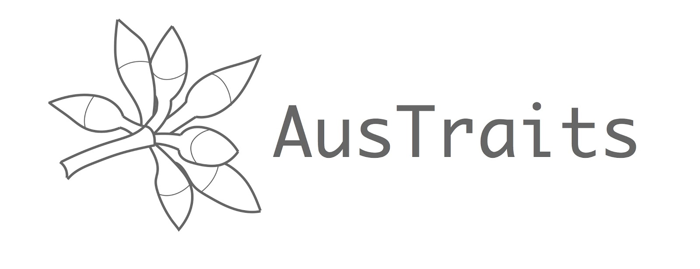

```{=html}
<section class="platform-hero" aria-labelledby="hero-title">
  <div class="platform-shell hero-grid">
    <div class="hero-copy">
      <p class="eyebrow">Open trait data for Australian plants</p>
      <h1 id="hero-title">Explore AusTraits</h1>
      <p class="hero-subtitle">Trait data for Australia's flora, harmonised and ready for ecological research, biodiversity infrastructure, and conservation decision-making.</p>
      <div class="hero-actions" aria-label="Primary actions">
        <a class="btn-primary" href="#access"><i class="bi bi-cloud-arrow-down"></i> Access data</a>
        <a class="button text-button" href="https://w3id.org/APD" target="_blank" rel="noopener">AusTraits Plant Dictionary</a>
        <a class="button text-button" href="https://traitecoevo.github.io/APCalign/" target="_blank" rel="noopener">APCalign</a>
      </div>
    </div>
    <div class="hero-brand" aria-label="AusTraits">
      
    </div>
  </div>
</section>

<section class="page-band stats-band" aria-label="AusTraits key facts">
  <div class="platform-shell">
    <div class="trust-strip">
      <div class="trust-item">
        <span class="trust-value">500+</span>
        <span class="trust-label">plant traits</span>
      </div>
      <div class="trust-item">
        <span class="trust-value">30,000+</span>
        <span class="trust-label">plant taxa</span>
      </div>
      <div class="trust-item">
        <span class="trust-value">400+</span>
        <span class="trust-label">data sources</span>
      </div>
      <a class="trust-item trust-item-link" href="team/team-partners.html#data-contributors">
        <span class="trust-value">340+</span>
        <span class="trust-label">data contributors</span>
      </a>
      <div class="trust-item">
        <span class="trust-value">CC-BY 4.0</span>
        <span class="trust-label">open data licence</span>
      </div>
      <div class="trust-item">
        <span class="trust-value">FAIR</span>
        <span class="trust-label">metadata-rich resource</span>
      </div>
    </div>
  </div>
</section>

<section class="page-band intro-band">
  <div class="platform-shell intro-grid">
    <div>
      <p class="eyebrow on-light">Infrastructure</p>
      <h2>Built to make trait data reusable</h2>
    </div>
    <div class="intro-copy">
      <p>AusTraits synthesises plant trait data from field campaigns, published literature, taxonomic monographs, and individual taxon descriptions. The database integrates contributions from functional plant biology, plant physiology, plant taxonomy, conservation biology, and related disciplines.</p>
      <p>Entries are linked to detailed metadata, harmonised against trait definitions, and checked for consistency.</p>
      <p>The resource has grown over nearly a decade of collaboration and sustained investment &mdash; see the <a href="history.html">project history</a>.</p>
    </div>
  </div>
</section>

<section id="workflow" class="page-band workflow-band">
  <div class="platform-shell">
    <div class="section-header">
      <p class="eyebrow on-light">Workflow</p>
      <h2>From scattered observations to reliable infrastructure</h2>
      <p class="section-intro">AusTraits keeps the workflow visible: original sources are preserved, trait concepts are standardised, and releases are archived so analyses can be repeated later.</p>
    </div>
    <div class="workflow-grid">
      <article class="workflow-card">
        <span class="card-icon"><i class="bi bi-collection"></i></span>
        <h3>Assemble</h3>
        <p>Bring together field data, literature tables, floras, taxonomic descriptions, and researcher-contributed datasets.</p>
      </article>
      <article class="workflow-card">
        <span class="card-icon"><i class="bi bi-diagram-3"></i></span>
        <h3>Harmonise</h3>
        <p>Align names, trait definitions, units, methods, value types, and metadata into a relational database.</p>
      </article>
      <article class="workflow-card">
        <span class="card-icon"><i class="bi bi-cloud-check"></i></span>
        <h3>Publish</h3>
        <p>Release versioned data, documentation, R tooling, and linked biodiversity outputs for reuse.</p>
      </article>
    </div>
  </div>
</section>

<section id="access" class="page-band">
  <div class="platform-shell">
    <div class="section-header">
      <p class="eyebrow on-light">Access</p>
      <h2>Access data via diverse pathways</h2>
      <p class="section-intro">Choose the route that matches how you want to use the resource: download a full release, work programmatically, follow a tutorial, or connect through linked biodiversity platforms.</p>
    </div>
    <div class="explore-grid">
      <a class="resource-card" href="https://doi.org/10.5281/zenodo.3568417" target="_blank" rel="noopener">
        <span class="card-icon"><i class="bi bi-cloud-arrow-down"></i></span>
        <h3>Dataset releases</h3>
        <p>Download compiled AusTraits releases from Zenodo under an open CC-BY 4.0 licence.</p>
      </a>
      <a class="resource-card" href="https://traitecoevo.github.io/austraits/" target="_blank" rel="noopener">
        <span class="card-icon"><i class="bi bi-braces"></i></span>
        <h3>R interface</h3>
        <p>Download, join, filter, explore, and visualise AusTraits data in analysis workflows.</p>
      </a>
      <a class="resource-card" href="https://traitecoevo.github.io/traits.build-book/AusTraits_tutorial.html" target="_blank" rel="noopener">
        <span class="card-icon"><i class="bi bi-journal-text"></i></span>
        <h3>Tutorials</h3>
        <p>Follow worked examples for exploring and analysing data using project tooling.</p>
      </a>
      <a class="resource-card" href="https://bie.ala.org.au/species/https%3A//id.biodiversity.org.au/node/apni/2899127#ausTraits" target="_blank" rel="noopener">
        <span class="card-icon"><i class="bi bi-diagram-3"></i></span>
        <h3>ALA integration</h3>
        <p>Access taxon-level trait summaries through Atlas of Living Australia pages.</p>
      </a>
      <!-- TODO: add a panel for the data portal once the URL is confirmed
      <a class="resource-card" href="DATA_PORTAL_URL" target="_blank" rel="noopener">
        <span class="card-icon"><i class="bi bi-window-stack"></i></span>
        <h3>Data portal</h3>
        <p>Browse, filter, and query AusTraits data interactively in the browser.</p>
      </a>
      -->
    </div>
  </div>
</section>

<section id="structure" class="page-band structure-band">
  <div class="platform-shell feature-grid">
    <div class="feature-copy">
      <p class="eyebrow on-light">Traceable</p>
      <h2>Every record keeps its context</h2>
      <p class="section-intro">AusTraits is a relational, metadata-rich resource. Trait values, taxonomic concepts, methods, sources, and contextual information are kept explicit so users can trace and evaluate the data they use.</p>
    </div>
    <div class="image-panel structure-panel">
      
    </div>
  </div>
</section>

<section id="software" class="page-band tools-band">
  <div class="platform-shell">
    <div class="section-header">
      <p class="eyebrow on-light">Tools</p>
      <h2>An ecosystem for harmonised trait data</h2>
      <p class="section-intro">AusTraits is supported by open tools that help researchers build, access, align, and interpret harmonised trait databases.</p>
    </div>
    <div class="tools-grid">
      <article class="software-card">
        
        <div>
          <h3>traits.build</h3>
          <p>Data model & workflow for building harmonised ecological trait databases ...
            <a href="https://traitecoevo.github.io/traits.build/" target="_blank" rel="noopener">more</a></p>
        </div>
      </article>
      <article class="software-card">
        
        <div>
          <h3>austraits</h3>
          <p>R interface for accessing, wrangling, combining, and visualising data.... <a href="https://traitecoevo.github.io/austraits/" target="_blank" rel="noopener">more</a></p>
        </div>
      </article>
      <article class="software-card">
        
        <div>
          <h3>APCalign</h3>
          <p>An R package and Shiny app for aligning Australian vascular plant names...
            <a href="https://github.com/traitecoevo/APCalign" target="_blank" rel="noopener">more</a></p>
        </div>
      </article>
      <article class="software-card">
        
        <div>
          <h3>APD</h3>
          <p>Formal vocabulary for trait concepts, definitions, allowed values, units, and links ...
            <a href="https://w3id.org/APD" target="_blank" rel="noopener">more</a>
        </div>
      </article>
    </div>
  </div>
</section>

<section id="data-products" class="page-band products-band">
  <div class="platform-shell feature-grid reverse-feature">
    <div class="feature-copy">
      <p class="eyebrow on-light">Coverage</p>
      <h2>Expanding coverage of the Australian flora</h2>
      <p>AusTraits includes thousands of trait values extracted from taxonomic descriptions <a href="https://doi.org/10.1016/j.ecoinf.2023.102312" target="_blank" rel="noopener">(Coleman et al. 2023)</a>.</p>
      <p>We have gap-filled near-complete trait tables for core traits such as life history, plant growth form, and woodiness <a href="https://doi.org/10.1071/BT23111" target="_blank" rel="noopener">(Wenk et al. 2024)</a>.</p>
        
      <p>Planned extensions:</p>
      <ul>
        <li>Near-complete coverage of plant height and leaf size.</li>
        <li>Species- and location-level trait summaries.</li>
        <li>Pollination traits.</li>
      </ul>
    </div>
    <div class="data-product-panel">
      <div class="data-product-row">
        <span>Taxonomic descriptions</span>
        <strong>570,000 values</strong>
      </div>
      <div class="data-product-row">
        <span>Core gap-filled traits</span>
        <strong>Near-complete tables</strong>
      </div>
      <div class="data-product-row">
        <span>Species summaries</span>
        <strong>Planned</strong>
      </div>
    </div>
  </div>
</section>

<section class="page-band cta-band">
  <div class="platform-shell cta-grid">
    <div>
      <p class="eyebrow">Get involved</p>
      <h2>Contribute data or get in touch</h2>
      <p>AusTraits is built on data contributed by <a href="team/team-partners.html#data-contributors">340+ researchers</a>. We'd love to hear how you use AusTraits, and to help with contributing new or legacy datasets, access, or citation. Email <a href="mailto:austraits.database@gmail.com">austraits.database@gmail.com</a>.</p>
    </div>
    <div class="cta-actions">
      <a class="btn-primary" href="contribute.html"><i class="bi bi-database-add"></i> Contribute data</a>
      <a class="btn-secondary" href="mailto:austraits.database@gmail.com"><i class="bi bi-envelope"></i> Contact the team</a>
    </div>
  </div>
</section>
```
