## Core Team

**Our core AusTraits team maintains, expands, and enhances AusTraits, supported by an advisory board and a wider community of AusTraits champions.**


```{=html}
<div class="team-grid">

  <div class="team-member">
    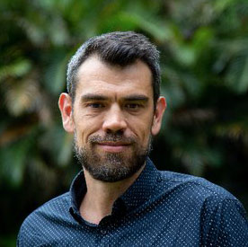
    <h5>Assoc. Prof. Daniel Falster</h5>
    <p>Joint Project Lead</p>
  </div>

  <div class="team-member">
    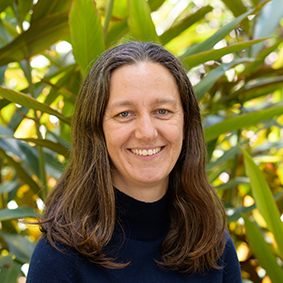
    <h5>Assoc. Prof. Rachael Gallagher</h5>
    <p>Joint Project Lead</p>
  </div>

  <div class="team-member">
    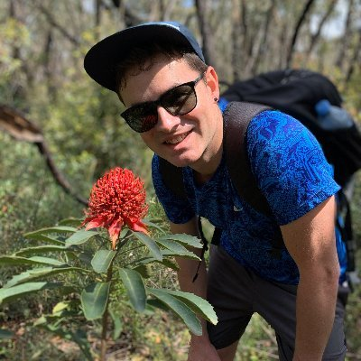
    <h5>Dr. Hervé Sauquet</h5>
    <p>Joint Project Lead</p>
  </div>

  <div class="team-member">
    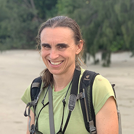
    <h5>Dr. Elizabeth Wenk</h5>
    <p>Project Manager</p>
  </div>

  <div class="team-member">
    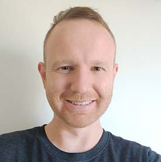
    <h5>Dr. David Coleman</h5>
    <p>Project Officer</p>
  </div>

  <div class="team-member">
    
    <h5>Pushkal Garg</h5>
    <p>Data Portal Developer</p>
  </div>

  <div class="team-member">
    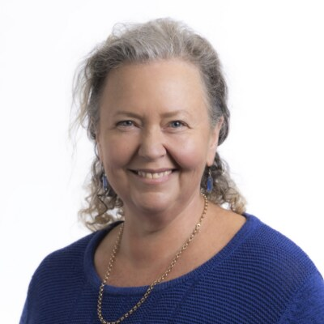
    <h5>Julia Martin</h5>
    <p>ARDC Program Manager</p>
  </div>

  <!-- Add more team members as needed -->
</div>

```

## Advisory Board

**Our advisory board guides the strategic direction of AusTraits, bringing expertise from herbaria, botanic gardens, universities, and government.**

```{=html}
<div class="team-grid">

  <div class="team-member">
    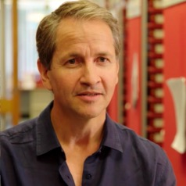
    <h5>Prof. Darren Crayn</h5>
    <p>James Cook University</p>
  </div>

  <div class="team-member">
    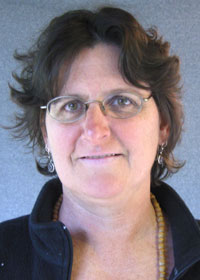
    <h5>Anne Fuchs</h5>
    <p>Dept. of Climate Change, Energy, the Environment and Water</p>
  </div>

  <div class="team-member">
    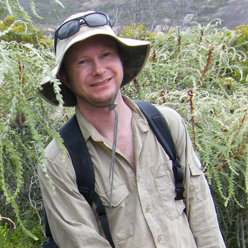
    <h5>Dr. Carl Gosper</h5>
    <p>Dept. of Biodiversity, Conservation and Attractions (WA)</p>
  </div>

  <div class="team-member">
    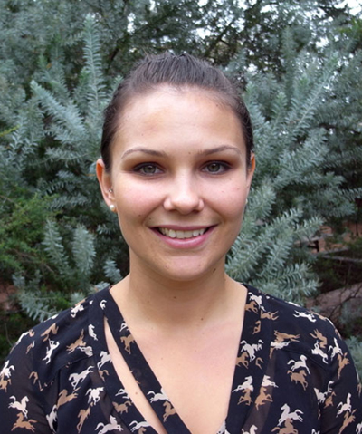
    <h5>Dr. Lydia Guja</h5>
    <p>Australian National Botanic Gardens</p>
  </div>

  <div class="team-member">
    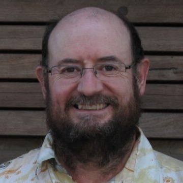
    <h5>Prof. Greg Jordan</h5>
    <p>University of Tasmania</p>
  </div>

  <div class="team-member">
    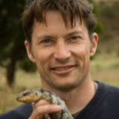
    <h5>Prof. Michael Kearney</h5>
    <p>University of Melbourne</p>
  </div>

  <div class="team-member">
    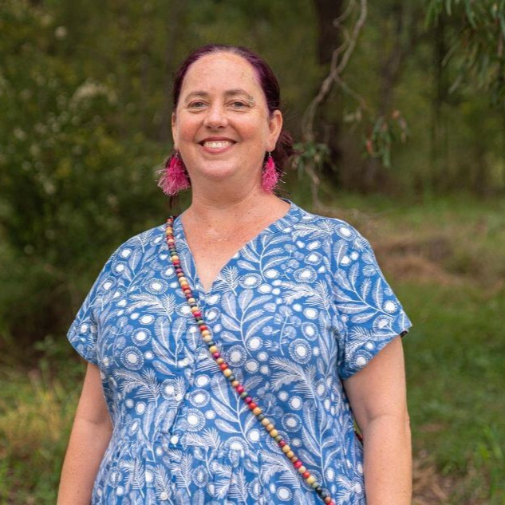
    <h5>Dr. Hannah McPherson</h5>
    <p>Royal Botanic Garden Sydney</p>
  </div>

  <div class="team-member">
    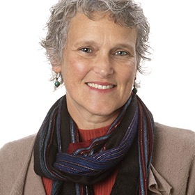
    <h5>Prof. Adrienne Nicotra</h5>
    <p>Australian National University</p>
  </div>

  <div class="team-member">
    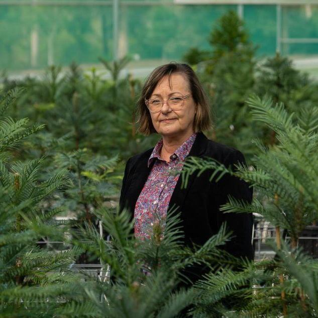
    <h5>Dr. Cathy Offord</h5>
    <p>Australian Botanic Garden, Mount Annan</p>
  </div>

  <div class="team-member">
    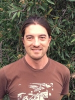
    <h5>Dr. Mark Ooi</h5>
    <p>UNSW Sydney</p>
  </div>

  <div class="team-member">
    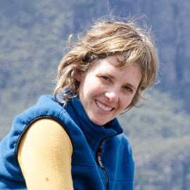
    <h5>Dr. Libby Rumpff</h5>
    <p>Dept. of Climate Change, Energy, the Environment and Water</p>
  </div>

  <div class="team-member">
    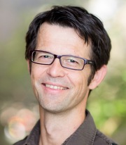
    <h5>Prof. Peter Vesk</h5>
    <p>University of Melbourne</p>
  </div>

  <div class="team-member">
    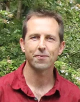
    <h5>Prof. Ian Wright</h5>
    <p>Western Sydney University</p>
  </div>

  <!-- Add more team members as needed -->
</div>

```

## Data Contributors

**The creation of the AusTraits database was only possible because of the researchers who contributed data to this endeavour. We gratefully acknowledge everyone listed below, drawn from the [AusTraits Zenodo record](https://doi.org/10.5281/zenodo.3568417).**

```{r, echo=FALSE, results='asis', message=FALSE, warning=FALSE}
candidates <- c("data/zenodo/3568417.json", "../data/zenodo/3568417.json")
filename <- candidates[file.exists(candidates)][1]

if (!is.na(filename)) {
  x <- jsonlite::fromJSON(filename)
  raw <- x$metadata$contributors$name

  esc <- function(s) {
    s <- gsub("&", "&amp;", s, fixed = TRUE)
    s <- gsub("<", "&lt;", s, fixed = TRUE)
    gsub(">", "&gt;", s, fixed = TRUE)
  }
  # reformat "Last, First" -> "First Last"
  reformat <- function(n) {
    parts <- strsplit(n, ",\\s*")[[1]]
    if (length(parts) >= 2) paste(trimws(parts[2]), trimws(parts[1])) else trimws(n)
  }

  ord <- order(tolower(raw))                 # alphabetical by surname
  display <- vapply(raw[ord], reformat, character(1))
  display <- unique(display)

  cat(sprintf("<p>%d researchers have contributed data to AusTraits.</p>\n", length(display)))
  cat('<ul class="contributors-list">')
  for (nm in display) cat(sprintf('<li>%s</li>', esc(nm)))
  cat('</ul>')
} else {
  cat('<p>See the <a href="https://doi.org/10.5281/zenodo.3568417">AusTraits Zenodo record</a> for the full list of contributors.</p>')
}
```

## AusTraits Champions

**Over the years, many people have championed AusTraits — contributing data, expertise, and advocacy in a variety of roles. We gratefully acknowledge our current and past champions.**

```{=html}
<ul class="champions-list">
  <li>Dr. Sam Andrew</li>
  <li>Dr. Russell Barrett</li>
  <li>Dr. Elisa Bayraktarov</li>
  <li>Dr. Mike Bayly</li>
  <li>Luc Betbeder-Matibet</li>
  <li>Dr. Bek Christensen</li>
  <li>Assoc. Prof. Will Cornwell</li>
  <li>Lily Dun</li>
  <li>Dr. Claire Farrell</li>
  <li>Christopher Franks</li>
  <li>Prof. Caroline Gross</li>
  <li>Dr. Cécile Gueidan</li>
  <li>Prof. Greg Guerin</li>
  <li>Hamish Holewa</li>
  <li>Kerry Levett</li>
  <li>Dr. Hannah Lloyd</li>
  <li>Dr. Brian Maitner</li>
  <li>Dr. James McCarthy</li>
  <li>Prof. Belinda Medlyn</li>
  <li>Dr. Renske Onstein</li>
  <li>Jon Smilie</li>
  <li>Assoc. Prof. Ben Sparrow</li>
  <li>Assoc. Prof. Rachael Standish</li>
  <li>Dr. Kevin Thiele</li>
  <li>Dr. Gary Truong</li>
  <li>Dr. Haylee Weaver</li>
  <li>Anthony Whalen</li>
  <li>Dr. Matt White</li>
  <li>Sophie Yang</li>
</ul>
```

## Past Partners & Supporters {#past-partners}

**AusTraits grew through the support of many organisations over the years. We gratefully acknowledge our past partners and supporters.**

```{=html}
<div class="partners-grid past-partners-grid">
  <a class="partner-logo-link" href="https://www.mq.edu.au/" target="_blank" rel="noopener" title="Macquarie University">
    
  </a>
  <a class="partner-logo-link" href="https://www.tern.org.au/" target="_blank" rel="noopener" title="TERN">
    
  </a>
  <a class="partner-logo-link" href="https://ecocommons.org.au/" target="_blank" rel="noopener" title="EcoCommons">
    
  </a>
  <a class="partner-logo-link" href="https://bccvl.org.au/" target="_blank" rel="noopener" title="BCCVL">
    
  </a>
  <a class="partner-logo-link" href="https://www.environment.gov.au/science/abrs" target="_blank" rel="noopener" title="ABRS">
    
  </a>
  <a class="partner-logo-link" href="https://www.landcareresearch.co.nz/" target="_blank" rel="noopener" title="Manaaki Whenua – Landcare Research">
    
  </a>
</div>
```
